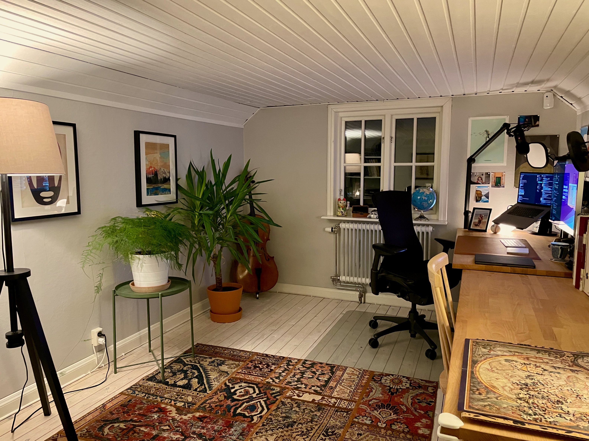

- 想要一个属于自己的阁楼 #装修
  {:height 259, :width 284}
- 学习的四个阶段 #mindsets 
  1. 无意识的无能 - “我不知道我有多糟糕”
  2. 有意识的无能 -  “这很糟糕。我知道我有多糟糕”
  4. 有意识的能力 - “如果我专注，我可以做到这一点”
  5. 无意识的能力 - “我不记得过去10分钟驾驶汽车的情况”
  #+BEGIN_QUOTE
  大部分人在第二阶段退出
  当你知道你有多糟糕时，说明你有足够好的品味，你的作品与它有些差距。这个时候你能做的，需要做的，最重要的事，就是大量的创作，不要放弃。
  推荐视频[The Gap](https://vimeo.com/85040589)
  #+END_QUOTE