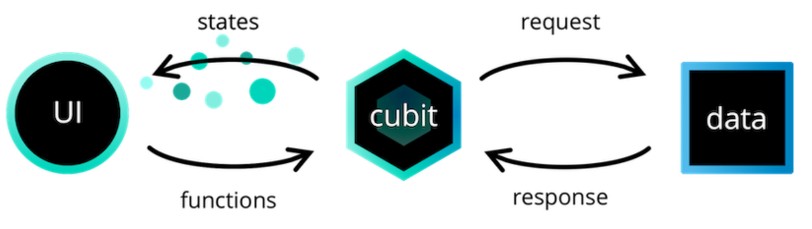
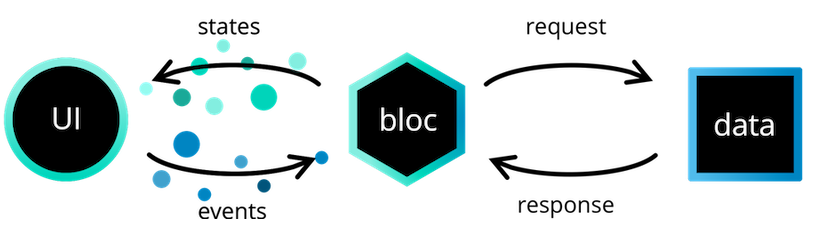

- https://bloclibrary.dev
-
- 一个为 Dart 而生，可预测和管理状态的库
-
- 为什么要用
	- 将展示层的代码与业务逻辑分开
-
- 设计时考虑到了三个核心价值
	- `简单`
	  易于理解，可供技能水平不同的开发人员使用。
	- `强劲`
	  通过将它们组成更小的组件，帮助制作出色而复杂的应用程序。
	- `可测试`
	  轻松测试应用程序的各个方面，以便我们可以自信地进行迭代。
-
- bloc核心思想
	- 流（Streams)是一系列异步的数据.
		- [Dart官方文档](https://dart.dev/tutorials/language/streams)
	- [Cubit](https://bloclibrary.dev/#/zh-cn/coreconcepts?id=cubit)
	  
	- [Bloc](https://bloclibrary.dev/#/zh-cn/coreconcepts?id=bloc)
	  
	- Cubit vs. Bloc
		- Cubit 的优势
			- `简单`，更容易理解，涉及的代码更少
				- 创建Cubit 时，只需要定义状态和改变状态的函数。
				- 创建 Bloc 时，必须定义状态、事件和 EventHandler 实现。
		- Bloc 的优势
			- `可追溯性`
				- 知道状态变化的顺序以及触发这些变化的确切原因。对于对于应用程序功能至关重要的状态，使用更多事件驱动的方法来捕获状态变化之外的所有事件可能会非常有益。
			- `高级的事件转换`
				- 需要利用反应性运算符，例如：buffer, debounceTime, throttle 等。
		- #+BEGIN_TIP
		  如果仍然不确定要使用哪种，请从 Cubit 开始，然后可以根据需要将其重构或放大为 Bloc。
		  #+END_TIP
-
- Flutter Bloc的核心理念
	- Bloc Widgets
		- `BlocBuilder`
			- 在接收到新的状态(State)时处理构建部件
		- `BlocSelector`
			- 和 `BlocBuilder` 类似的组件，但它可以选择一个基于当前bloc状态的新值来过滤更新。如果所选值不更改，则会阻止不必要的构建。
		- `BlocProvider`
			- 可通过`BlocProvider.of <T>（context)`向其子级提供bloc。
			- 在大多数情况下，应该使用`BlocProvider`来创建新的blocs，并将其提供给其余子树。
		- `MultiBlocProvider`
			- 将多个`BlocProvider`部件合并为一个。
		- `BlocListener`
			- 响应该状态(state)的变化。
			- 应用于每次状态更改都需要发生一次的功能，例如导航，显示SnackBar，显示Dialog等。
		- `MultiBlocListener`
			- 将多个`BlocListener`部件合并为一个。
		- `BlocConsumer`
			- 对新状态(State)做出反应。
			- 仅在有必要重建UI并执行其他反应来声明bloc中的状态(State)更改时，才应使用`BlocConsumer`。
		- `RepositoryProvider`
			- 可通过`RepositoryProvider.of <T>（context)`向其子级提供存储库。
			- `BlocProvider`用于提供bloc，而`RepositoryProvider`仅用于存储库。
		- `MultiRepositoryProvider`
			- 将多个`RepositoryProvider`部件(widgets)合并为一个。